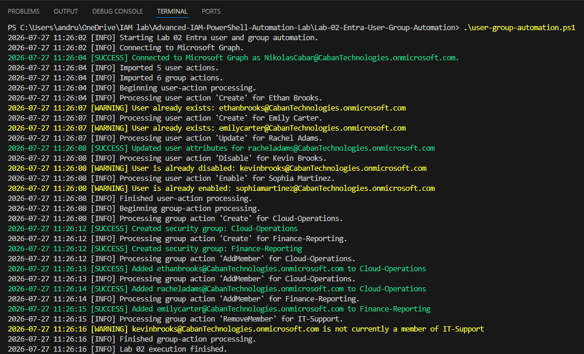
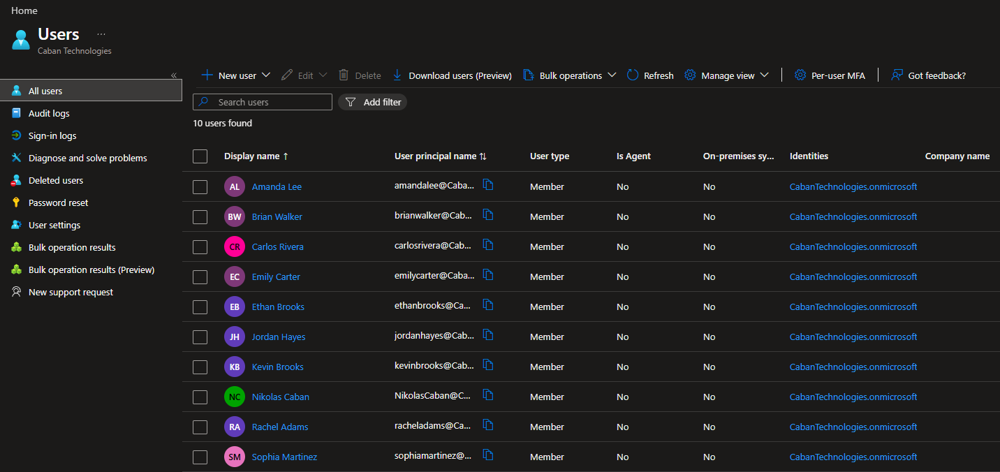
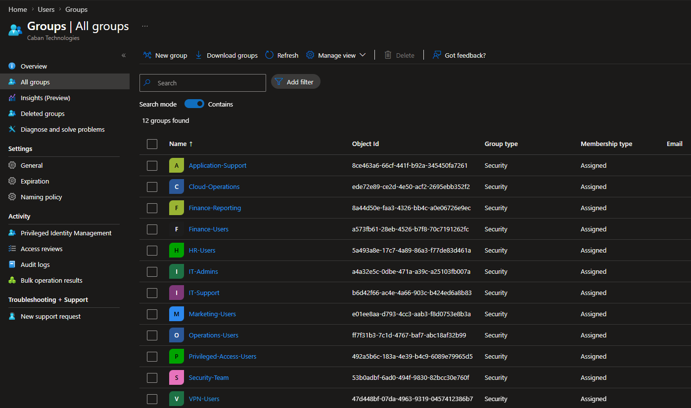
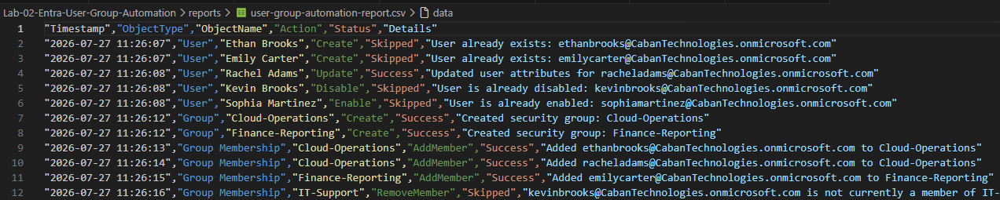

# Lab 02 - Microsoft Entra User & Group Automation with PowerShell

## Overview

This lab demonstrates how to automate common Microsoft Entra ID identity administration tasks using Microsoft Graph PowerShell. The project processes user and group actions from CSV files, performs lifecycle management operations, records detailed logs, and generates execution reports.

The project was designed using a modular PowerShell architecture to improve readability, maintainability, and scalability.

---

## Objectives

- Automate Microsoft Entra user lifecycle management
- Automate security group creation and membership management
- Process bulk operations from CSV files
- Generate detailed execution logs
- Create execution reports
- Implement reusable PowerShell modules

---

## Technologies Used

- Microsoft Entra ID
- Microsoft Graph PowerShell SDK
- PowerShell 7
- Microsoft Graph API
- CSV Data Processing
- Visual Studio Code

---

## Project Structure

```
Lab-02-Entra-User-Group-Automation
│
├── modules
│   ├── GraphConnection.ps1
│   ├── GroupManagement.ps1
│   ├── Logging.ps1
│   ├── Reporting.ps1
│   └── UserManagement.ps1
│
├── logs
│
├── reports
│
├── screenshots
│
├── users.csv
├── groups.csv
│
├── README.md
└── user-group-automation.ps1
```

---

## Module Breakdown

### GraphConnection.ps1

Handles authentication to Microsoft Graph using the required delegated permissions.

Responsibilities:

- Connect to Microsoft Graph
- Verify successful authentication
- Display connection status

---

### UserManagement.ps1

Processes all user lifecycle operations.

Supported actions:

- Create User
- Update User Attributes
- Enable User
- Disable User

---

### GroupManagement.ps1

Processes security group administration.

Supported actions:

- Create Security Group
- Add Group Members
- Remove Group Members

---

### Logging.ps1

Creates detailed execution logs including:

- Informational messages
- Success messages
- Warning messages
- Error messages

---

### Reporting.ps1

Builds a CSV execution report documenting every action performed during script execution.

---

## Features

✔ Bulk user provisioning

✔ User attribute updates

✔ User enable/disable automation

✔ Security group creation

✔ Automated group membership management

✔ CSV driven workflow

✔ Detailed logging

✔ Execution reporting

✔ Modular PowerShell architecture

---

## Sample User Actions

The lab demonstrates:

- Creating new users
- Updating existing users
- Disabling departed users
- Re-enabling existing users

Example users include:

- Ethan Brooks
- Emily Carter
- Rachel Adams
- Kevin Brooks
- Sophia Martinez

---

## Sample Group Actions

- Create Cloud-Operations
- Create Finance-Reporting
- Add users to security groups
- Remove users from security groups

---

## Sample Execution Output

```
[INFO] Connecting to Microsoft Graph...
[SUCCESS] Connected to Microsoft Graph
[INFO] Imported 5 user actions.
[INFO] Imported 6 group actions.

[SUCCESS] Created security group: Cloud-Operations
[SUCCESS] Created security group: Finance-Reporting

[SUCCESS] Added Ethan Brooks to Cloud-Operations
[SUCCESS] Added Rachel Adams to Cloud-Operations
[SUCCESS] Added Emily Carter to Finance-Reporting

[INFO] Lab 02 execution finished.
```

---

## Skills Demonstrated

- Identity Lifecycle Management
- Microsoft Entra Administration
- Microsoft Graph PowerShell
- PowerShell Automation
- CSV Data Processing
- Modular Script Design
- Error Handling
- Logging
- Reporting
- IAM Automation

---


## Screenshots

### Successful Script Execution



---

### Microsoft Entra Users



---

### Security Groups



---

### Generated Report



---

## Author

Nikolas Caban
