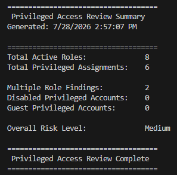
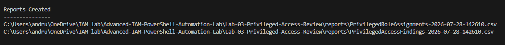
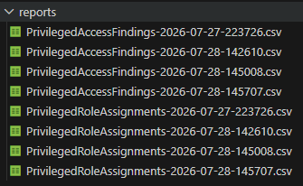
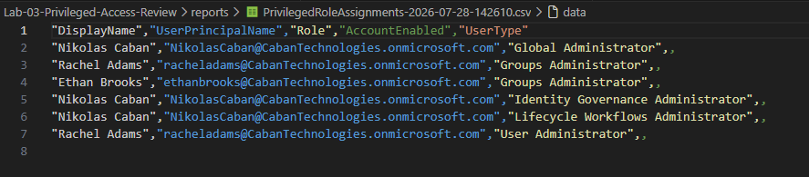

# Lab 03 – Privileged Access Review

## Overview

This lab demonstrates how to automate privileged access reviews in Microsoft Entra ID using Microsoft Graph PowerShell.

The script connects to Microsoft Graph, audits privileged directory role assignments, identifies common IAM security risks, exports audit reports, and generates an executive summary suitable for administrators and security teams.

---

## Features

- Authenticate to Microsoft Graph
- Retrieve active Microsoft Entra directory roles
- Enumerate privileged role assignments
- Detect users with multiple privileged role assignments
- Detect disabled privileged accounts
- Detect guest accounts assigned privileged roles
- Generate timestamped CSV audit reports
- Generate timestamped execution logs
- Display an executive summary with overall risk level

---

## Technologies Used

- PowerShell 7
- Microsoft Graph PowerShell SDK
- Microsoft Entra ID
- Microsoft Graph API

---

## Project Structure

```text
Lab-03-Privileged-Access-Review
│
├── modules
│   ├── GraphConnection.ps1
│   ├── Logging.ps1
│   ├── Reporting.ps1
│   └── RoleAudit.ps1
│
├── logs
├── reports
├── screenshots
│
├── privileged-access-review.ps1
└── README.md
```

---

## Security Checks Performed

The script currently performs the following privileged access reviews:

- Multiple privileged role assignments
- Disabled privileged accounts
- Guest accounts with privileged roles

---

## Sample Output

### Executive Summary



---

### Reports Generated



---

### Reports Folder



---

### Role Assignment Report



---

## Generated Reports

The script exports two CSV reports during every execution.

| Report | Description |
|---------|-------------|
| PrivilegedRoleAssignments | Complete list of privileged role assignments |
| PrivilegedAccessFindings | Security findings identified during the audit |

---

## Learning Objectives

This lab demonstrates practical IAM concepts including:

- Microsoft Graph authentication
- Directory role auditing
- Role assignment analysis
- Security risk identification
- PowerShell automation
- CSV reporting
- Operational logging

---