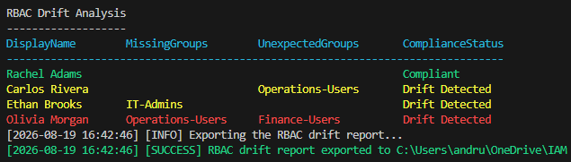
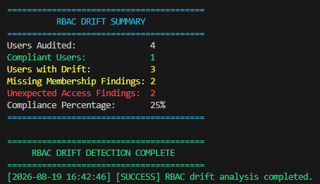
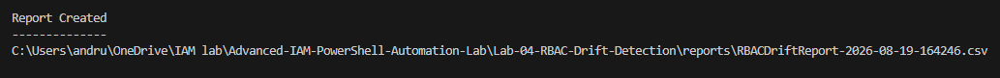
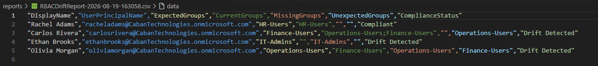

# Lab 04 – RBAC Drift Detection

## Overview

This lab demonstrates how to detect role-based access control (RBAC) drift in Microsoft Entra ID using PowerShell and the Microsoft Graph PowerShell SDK.

The automation compares an approved RBAC baseline against current Entra security-group memberships. It identifies missing access, unexpected access, and compliant accounts before producing a color-coded terminal analysis, compliance summary, timestamped report, and execution log.

## Objectives

- Define an approved RBAC baseline
- Retrieve current Entra group memberships
- Compare expected access with current access
- Identify missing group memberships
- Identify unexpected group memberships
- Calculate an overall compliance percentage
- Generate timestamped audit reports and logs

## Technologies Used

- PowerShell 7
- Microsoft Graph PowerShell SDK
- Microsoft Entra ID
- Visual Studio Code
- CSV data processing
- Git and GitHub

## Project Structure

```text
Lab-04-RBAC-Drift-Detection
│
├── baseline
│   └── ExpectedRBAC.csv
│
├── modules
│   ├── Baseline.ps1
│   ├── DriftDetection.ps1
│   ├── GraphConnection.ps1
│   ├── Logging.ps1
│   └── Reporting.ps1
│
├── logs
├── reports
├── screenshots
│
├── rbac-drift-detection.ps1
└── README.md
```

## How the Automation Works

```text
Approved RBAC Baseline
          |
          v
Import ExpectedRBAC.csv
          |
          v
Retrieve Current Entra Memberships
          |
          v
Compare Expected vs. Current Access
          |
          v
Detect Missing and Unexpected Access
          |
          v
Generate Report, Log, and Summary
```

## Test Scenario

The lab uses four test users with controlled group memberships.

| User | Expected access | Intentional current state | Expected result |
|---|---|---|---|
| Rachel Adams | `HR-Users` | `HR-Users` | Compliant |
| Carlos Rivera | `Finance-Users` | `Finance-Users`; `Operations-Users` | Unexpected access |
| Ethan Brooks | `IT-Admins` | No managed group access | Missing access |
| Olivia Morgan | `Operations-Users` | `Finance-Users` | Missing and unexpected access |

## Drift Conditions

### Missing access

A group appears in the approved baseline but is absent from the user’s current memberships.

Example:

```text
Expected: IT-Admins
Current:  None
Finding:  Missing IT-Admins
```

### Unexpected access

A user currently belongs to a managed group that is not included in their approved baseline.

Example:

```text
Expected: Finance-Users
Current:  Finance-Users; Operations-Users
Finding:  Unexpected Operations-Users
```

### Compliant access

The user’s current controlled memberships exactly match the approved baseline.

## Microsoft Graph Permissions

The script requests the following delegated, read-only permissions:

```text
User.Read.All
GroupMember.Read.All
```

These permissions allow the automation to locate the baseline users and inspect their group memberships without modifying Entra objects.

## How to Run

Open PowerShell 7 in the Lab 04 directory.

Connect to Microsoft Graph:

```powershell
Connect-MgGraph `
    -Scopes "User.Read.All","GroupMember.Read.All" `
    -UseDeviceAuthentication `
    -NoWelcome
```

Confirm the connection:

```powershell
Get-MgContext | Select-Object Account, TenantId
```

Run the drift-detection script:

```powershell
.\rbac-drift-detection.ps1
```

## Generated Output

Each execution creates:

```text
logs\RBACDriftDetection-[timestamp].log
reports\RBACDriftReport-[timestamp].csv
```

The CSV report contains:

- Display name
- User principal name
- Expected groups
- Current groups
- Missing groups
- Unexpected groups
- Compliance status

## Screenshots

### RBAC Drift Analysis

The color-coded analysis displays compliant accounts in green, single drift conditions in yellow, and combined missing/unexpected access in red.



### RBAC Drift Summary

The executive summary displays the number of users audited, compliant users, drifted users, membership findings, and overall compliance percentage.



### Report Created

The script displays the location of the timestamped CSV report generated during execution.



### RBAC Drift Report

The generated report provides structured audit evidence for every account evaluated.



## Results

The controlled test produced the following results:

```text
Users Audited:               4
Compliant Users:             1
Users with Drift:            3
Missing Membership Findings: 2
Unexpected Access Findings:  2
Compliance Percentage:       25%
```

## Skills Demonstrated

- Microsoft Entra administration
- Microsoft Graph PowerShell
- RBAC governance
- Expected-state configuration
- Access drift detection
- PowerShell functions and modularization
- CSV import and export
- Error handling
- Timestamped logging
- Audit reporting
- Compliance measurement

## Lessons Learned

This lab demonstrated that RBAC drift is the difference between approved access and actual access—not a special property applied to an account.

The project also reinforced the importance of:

- Maintaining an authoritative access baseline
- Limiting comparisons to managed RBAC groups
- Detecting both excessive and missing access
- Producing audit-friendly evidence
- Separating PowerShell functionality into focused modules

