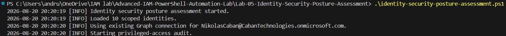
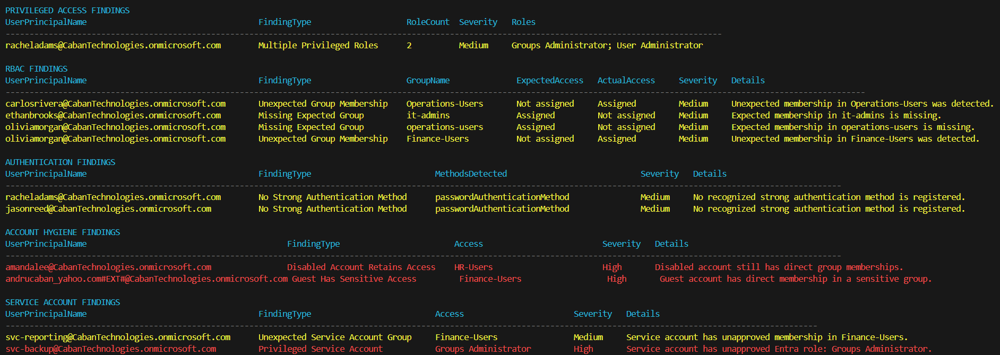
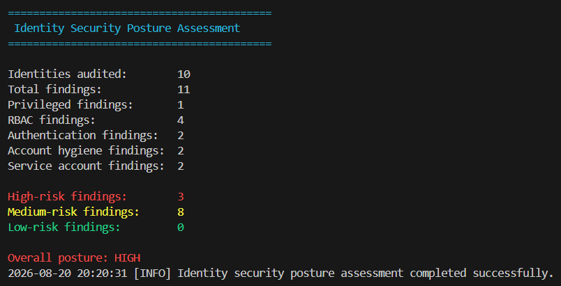
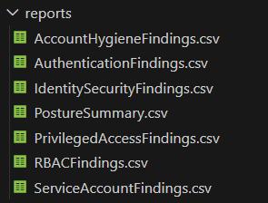

# Lab 05 – Identity Security Posture Assessment

## Overview

This lab uses PowerShell and Microsoft Graph to assess identity security across a Microsoft Entra ID tenant.

The assessment combines privileged-access analysis, RBAC drift detection, authentication-method checks, account-hygiene checks, and service-account auditing. Results are displayed in a color-coded console view and exported as CSV reports.

## Assessment Areas

The solution evaluates five identity-security categories:

1. Privileged access
2. RBAC and group-access drift
3. Authentication security
4. Account hygiene
5. Service-account access

## Folder Structure

```text
Lab-05-Identity-Security-Posture-Assessment/
│
├── baseline/
│   ├── AssessmentScope.csv
│   ├── ExpectedRBAC.csv
│   └── ServiceAccounts.csv
│
├── modules/
│   ├── GraphConnection.ps1
│   ├── Logging.ps1
│   ├── PrivilegedAccessAudit.ps1
│   ├── RBACAudit.ps1
│   ├── AuthenticationAudit.ps1
│   ├── AccountHygieneAudit.ps1
│   ├── ServiceAccountAudit.ps1
│   └── Reporting.ps1
│
├── logs/
├── reports/
├── screenshots/
│
├── identity-security-posture-assessment.ps1
└── README.md
```

## PowerShell Modules

### GraphConnection.ps1

Connects to Microsoft Graph with the permissions required by the assessment and records the connected account and tenant.

### Logging.ps1

Creates timestamped log files and records informational, warning, and error messages.

### PrivilegedAccessAudit.ps1

Identifies scoped identities holding multiple directly assigned active Microsoft Entra roles.

### RBACAudit.ps1

Compares expected group memberships with direct Entra group memberships and identifies:

- Missing expected access
- Unexpected group memberships

### AuthenticationAudit.ps1

Checks selected users for recognized strong authentication methods, including:

- Microsoft Authenticator
- FIDO2 security keys
- Windows Hello for Business
- Software OATH
- Platform credentials
- Certificate authentication
- External authentication methods

### AccountHygieneAudit.ps1

Identifies:

- Disabled accounts that retain direct group access
- Guest accounts with direct access to sensitive groups

### ServiceAccountAudit.ps1

Compares service-account access with the approved baseline and identifies:

- Unapproved group memberships
- Unapproved privileged Entra roles

### Reporting.ps1

Combines all findings, calculates severity totals and overall posture, displays a color-coded summary, and exports CSV reports.

## Baseline Files

### AssessmentScope.csv

Defines the identities included in the assessment and identifies users selected for authentication auditing.

### ExpectedRBAC.csv

Defines approved group memberships for the RBAC comparison.

### ServiceAccounts.csv

Defines approved group memberships and Entra roles for service-style accounts.

## Microsoft Graph Permissions

The assessment requests these delegated Microsoft Graph permissions:

```text
User.Read.All
Group.Read.All
Directory.Read.All
RoleManagement.Read.Directory
UserAuthenticationMethod.Read.All
```

The signed-in account must have an appropriate Microsoft Entra role for reading other users’ authentication methods.

## Running the Assessment

Open PowerShell in the Lab 05 folder and run:

```powershell
.\identity-security-posture-assessment.ps1
```

The main script:

1. Loads every PowerShell module.
2. Validates the required baseline files.
3. Connects to Microsoft Graph when necessary.
4. Runs all five audit categories.
5. Displays color-coded findings.
6. Calculates the overall security posture.
7. Exports the assessment reports.
8. Writes a timestamped execution log.

## Severity Colors

The console output uses:

- Red for high-risk findings
- Yellow for medium-risk findings
- Green for low-risk or compliant results
- Cyan for headings

## Assessment Results

The completed lab assessed ten scoped identities and produced eleven findings.

| Category | Findings |
|---|---:|
| Privileged Access | 1 |
| RBAC | 4 |
| Authentication | 2 |
| Account Hygiene | 2 |
| Service Accounts | 2 |
| **Total** | **11** |

### Severity Summary

| Severity | Findings |
|---|---:|
| High | 3 |
| Medium | 8 |
| Low | 0 |

The resulting overall identity security posture was:

```text
HIGH
```

## Detected Conditions

The assessment identified:

- A user holding multiple privileged Entra roles
- Unexpected RBAC group membership
- Missing expected RBAC access
- Users without recognized strong authentication methods
- A disabled account retaining group access
- A guest account with sensitive group access
- A service account with unapproved group membership
- A service account with a privileged Entra role

## Generated Reports

The `reports` folder contains:

```text
AccountHygieneFindings.csv
AuthenticationFindings.csv
IdentitySecurityFindings.csv
PostureSummary.csv
PrivilegedAccessFindings.csv
RBACFindings.csv
ServiceAccountFindings.csv
```

`IdentitySecurityFindings.csv` contains the normalized master list of findings.

`PostureSummary.csv` contains category totals, severity totals, the number of identities assessed, and the overall posture.

## Screenshots

### Assessment Execution



### Color-Coded Findings



### Posture Summary



### Generated Reports



## Security Considerations

- The scripts use read-only Microsoft Graph permissions.
- Authentication secrets and passwords are not collected.
- Authentication-method results identify registered method types without exposing secret values.
- The assessment is limited to identities defined in the baseline files.
- Execution activity and errors are recorded in timestamped log files.
- Microsoft Graph is disconnected automatically only when the main script created the connection.

## Skills Demonstrated

- PowerShell modular design
- Microsoft Graph PowerShell authentication
- Microsoft Entra ID role auditing
- RBAC baseline comparison
- Authentication-method assessment
- Guest and disabled-account analysis
- Service-account governance
- Structured logging
- CSV reporting
- Risk classification
- Identity security posture analysis

## Author

Nikolas Caban